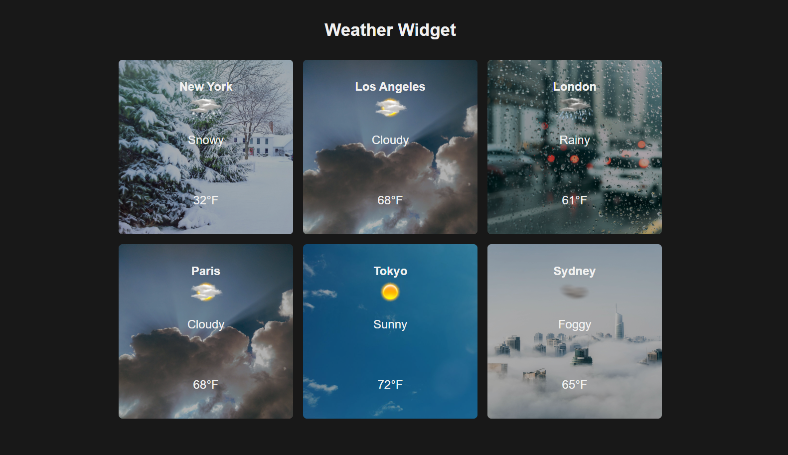
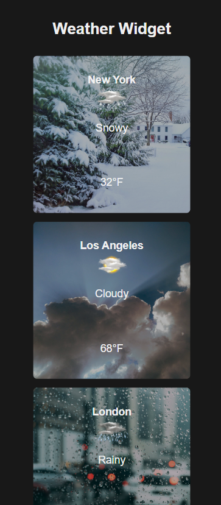

# Weather Widget App

Weather Widget is a basic and simple web application that displays weather for six locations using mock data from `weatherData.ts`. It's built with React, TypeScript, SCSS and Vite. The application is designed with responsiveness in mind, ensuring that the layout and components adapt seamlessly to different screen sizes and orientations, providing an optimal user experience on a variety of devices, including desktops, laptops, tablets and smartphones. There are three versions of the `App.tsx` and `WeatherCard.tsx` files, showcasing different design patterns. In this repo you will find two more branches: `with-compound-v1`, `with-compound-v2`.

## Version 1 (under the master branch): Standard Components

In this version, the `WeatherCard` component receives a `cityWeather` prop and directly utilizes sub-components like `City`, `WeatherIcon`, `WeatherName`, and `Temperature`.

## Version 2: Compound Components version 1 (under the with-compound-v1 branch):

In this version the `WeatherCard` component accepts a `weather` prop and children components. In the `App` component, child components are included as children of the `WeatherCard` component.

## Version 3: Compound Components version 2 (under the with-compound-v2 branch):

In this version the `WeatherCard` component accepts a `weather` prop and children components. In the `App` component, a single `WeatherCardContent` child component is included as children of the `WeatherCard` component.

## Screenshots
### Desktop View


### Mobile View


## Live Demo
Experience the Weather Widget App in action by visiting the live demo:

[Weather Widget Live Demo](https://obrm-weather-widget.netlify.app)

## Installation

To set up the Weather Widget App locally, follow these steps:

1. Ensure you have [Node.js](https://nodejs.org/en) and [Git](https://git-scm.com/) installed on your machine.
2. Clone the repository:

```
git clone https://github.com/obrm/weather-widget.git
```

3. Navigate to the project directory:

```
cd weather-widget
```

4. Install the required dependencies:
```
npm install
```

5. Start the development server:
```
npm run dev
```

The application should now be running at [http://localhost:5173](http://localhost:5173).

## Usage

To use the Weather Widget App, simply open it in your browser. The application will display the weather for six locations, with data sourced from the `weatherData.ts` file.

The app is responsive, providing a seamless experience on both desktop and mobile devices. Resize your browser window to see the layout adapt to different screen sizes.

#### Technologies Used

* [React](https://reactjs.org/)
* [TypeScript](https://www.typescriptlang.org/)
* [SCSS](https://sass-lang.com/)
* [Vite](https://vitejs.dev/)

#### License

[MIT](https://choosealicense.com/licenses/mit/)

## Contact Information
For any questions, concerns, or support, feel free to reach me out via email: [obrm770@gmail.com](mailto:obrm770@gmail.com).